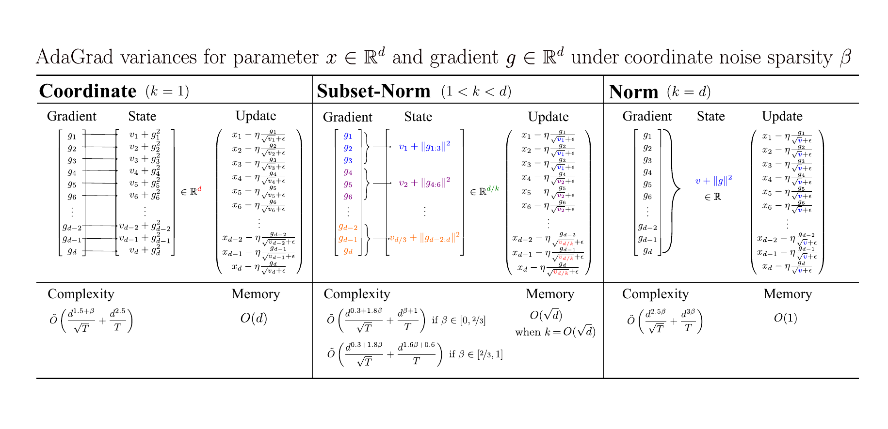

# AdamW-Subset-Norm 

Memory efficient adaptive stochastic optimization for deep learning with high probability convergence guarantee. 
Train faster with less memory and no additional hyperparameter tuning!

Reduces memory consumption of second moment term of Adam (adaptive step size) from $O(d)$ to $O(\sqrt{d})$. 
where $$d$$ is the total number of parameters. See `adamw_sn.py` for the full code.



**Important**:
-  This repo is built on top of [GaLore](https://github.com/jiaweizzhao/GaLore) where we add `adamw_sn.py` and 
modify `torchrun_main.py` to use the optimizer for the pre-training experiment. Note that `run_glue.py` hasn't been modified to use `adamw_sn` yet.
- The current version applies the subset-norm reduction to parameters of shape == 2 and reduce along with larger dimension. 
It does not reduce 1D params due to insignificant memory saving. Additional investigation is needed for parameters shape >= 3.
# Usage
The usage is simple and is identical to AdamW.

**Importing and Initializing the Optimizer**

The AdamwSN has a standard importing procedure with no additional configuration required. It uses the same hyperparameters as standard AdamW.

```python
from adamw_sn import AdamwSN

# Note that one can set beta1 = 0 to use RMSProp to save even more memory
optimizer = AdamwSN(model.parameters(), lr=0.001, betas=(beta1, beta2))
```

**Training loop**

The AdamwSN has a standard usage: 
```python
# Forward pass
outputs = model(inputs)
loss = loss_fn(outputs, targets)
# Backward pass and step
optimizer.zero_grad()
loss.backward()
optimizer.step()
```
# Implementation 
AdamwSN is a simple modification of AdamW:
```python
for p in group["params"]:
    grad = p.grad
    state = self.state[p]
    if "step" not in state:
        state["step"] = 0
    beta1, beta2 = group["betas"]

+   # Subset Norm
+   if "reduce_dim" not in state and len(grad.shape) == 2:
+       state["reduce_dim"] = 0 if grad.shape[0] >= grad.shape[1] else 1
+   if len(grad.shape) == 2:
+       second_moment_update = torch.norm(grad, dim=(1 - state["reduce_dim"]))
+   else:
+       second_moment_update = grad

    # State initialization
    if "exp_avg" not in state:
-       state["exp_avg"] = torch.zeros_like(p)
-       state["exp_avg_sq"] = torch.zeros_like(p)
+       state["exp_avg"] = torch.zeros_like(grad)
+       state["exp_avg_sq"] = torch.zeros_like(second_moment_update)

    exp_avg, exp_avg_sq = state["exp_avg"], state["exp_avg_sq"]

    state["step"] += 1

    exp_avg.mul_(beta1).add_(grad, alpha=(1.0 - beta1))
-   exp_avg_sq.mul_(beta2).addcmul_(grad, grad, value=1.0 - beta2)
+   exp_avg_sq.mul_(beta2).addcmul_(second_moment_update, second_moment_update, value=1.0 - beta2)

    denom = exp_avg_sq.sqrt().add_(group["eps"])

-   norm_grad = exp_avg / denom
+   # Compute update grad step
+   if len(grad.shape) == 2:  # work with 2D params for now
+       if state["reduce_dim"] == 0:  # broadcast rows
+           norm_grad = exp_avg / denom[:, None]
+       else:  # broadcast cols
+           norm_grad = exp_avg / denom[None, :]
+   else:  # standard
+       norm_grad = exp_avg / denom

    step_size = group["lr"]
    if group["correct_bias"]:  # No bias correction for Bert
        bias_correction1 = 1.0 - beta1 ** state["step"]
        bias_correction2 = 1.0 - beta2 ** state["step"]
        step_size = step_size * math.sqrt(bias_correction2) / bias_correction1

    p.add_(norm_grad, alpha=-step_size)
```

### AdamWSN Code Changes

The diff shows several key modifications to the AdamW optimizer implementation:

1. Subset Norm Calculation:
   - For 2D gradients, we reduce along the larger dimension and store the larger dimension in a new state called `reduce_dim`.
   - Calculates the subset norm term, `second_moment_update`, for 2D parameters and leaves the rest of the parameters the same.

2. Exponential Moving Average State Initialization and Update:
   - The initialization of `exp_avg_sq` is modified. It uses `torch.zeros_like(second_moment_update)`. This reduces the memory for 2D parameters from $O(d)$ to $O(\sqrt{d})$.
   - The update for `exp_avg_sq` now uses `second_moment_update` instead of `grad` in the `addcmul_` operation when compared to AdamW.

3. Broadcasting division for `norm_grad` computation
   - For `norm_grad` computation, we must broadcast the state `exp_avg_sq` correctly according to the reduced dimension.

4. The rest of the optimization step (including step size calculation and parameter update) remains unchanged.

