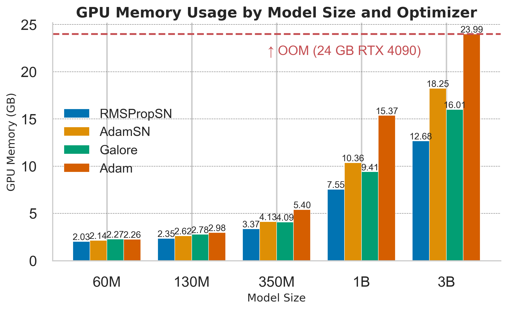

# AdamW-Subset-Norm 

Memory efficient adaptive stochastic optimization for deep learning with high probability convergence guarantee. 
Train faster with less memory and no additional hyperparameter tuning!

Reduces memory consumption of second moment term of Adam (adaptive step size) from $O(d)$ to $O(\sqrt{d})$. 
where $$d$$ is the total number of parameters. See `adamw_sn.py` for the full implementation for 2D parameters.

The figure below summarizes the algorithm and theoretical results for AdaGrad:



**Important**:
-  This repo is built on top of [GaLore](https://github.com/jiaweizzhao/GaLore) where we add `adamw_sn.py` and 
modify `torchrun_main.py` to use the optimizer for the pre-training experiment. Note that `run_glue.py` hasn't been modified to use `adamw_sn` yet.
- The current version applies the subset-norm reduction to parameters of shape == 2 and reduce along with larger dimension. 
It does not reduce 1D params due to insignificant memory saving. Additional investigation is needed for parameters shape >= 3.
## Adamw_SNG usage
This is the main AdamwSN General version where the user can specify the subset size. There are two ways you can use the optimizer:
(1) restrict the subset-norm step size to nn.Linear modules only or (2) perform the subset-norm step size on all parameters.
See the 2 sections below for usage in each case. 

In the paper, the best results are obtained when the SN step size is restricted to nn.Linear modules only: better convergence than Adam while using significantly less memory.
However, this restriction could be tough on distributed setup like FSDP, so we can perform subset-norm on all parameters which is a lot simpler. 
For the second case, the performance is about the same as Adam (but worse than case 1) in our experiments.

Finally, the learning rate for these optimizers with the recommended subset size is typically 10 times larger than you would set for Adam (coordinate-wise).
So for example, if you typically train AdamW with lr of 1e-4 then you could try AdamwSN with a lr of 1e-3 to start the hyperparameter search.  

### (1) Recommended: Perform SN compression on nn.Linear modules only
For transformers, compression seems the most effective when applied to nn.Linear modules only, which makes up the vast majority of the parameters of transformers.
One can use the AdamwSNG optimizer for linear modules only as follows: 
```python
from adamw_sng import AdamwSN

# suppose we parse args for `lr`, `weight_decay`, and `subset_size`
# suppose we have defined a `model` of type torch.nn.Module

sn_params = [module.weight for module in model.modules() if isinstance(module, nn.Linear)]
id_rownorm_params = [id(p) for p in sn_params]
regular_params = [p for p in model.parameters() if id(p) not in id_rownorm_params]
param_groups = [{'params': regular_params, 'sn': False},
                {'params': sn_params, 'sn': True}]
optimizer = AdamwSN(param_groups, lr=args.lr, weight_decay=args.weight_decay,
                    betas=(0.9, 0.999), subset_size=args.subset_size)
```

### (2) Generic case: subset size for arbitrary parameter or FSDP flattened concatenated
When your model contains other parameters or when partitioning the parameters into param_groups is not possible or efficient (such as in FSDP training), 
one can use the optimizer as a standard PyTorch optimizer:
```python
from adamw_sng import AdamwSN

# suppose we parse args for `lr`, `weight_decay`, and `subset_size`
# suppose we have defined a `model` of type torch.nn.Module
optimizer = AdamwSN(model.parameters(), lr=args.lr, weight_decay=args.weight_decay,
                    betas=(0.9, 0.999), subset_size=args.subset_size)
```

This seems to perform slightly worse than the Linear modules only version above (still similarly to vanilla Adam however).
However, with the speed gain in training, we can train for slightly longer to attain the same result. 

### Recommended subset size
If you do not know what subset_size to set, a good rule of thumb is to set it as $$d/2$$ where $$d$$ is the hidden dimension of your transformer model.
For example, the hidden dimension is 4096 for Llama 7B and so a good subset_size could be 2048. 

You can leave the `subset_size` argument to its default value of -1 to use the recommended subset size as stated above. 

## Adamw_SN simple partition scheme from paper usage
This version of AdamwSN requires no additional hyperparameter on top of Adam.  

**Importing the Optimizer**

Currently, we have only tested AdamSN on 2D Linear modules 
```python
from adamw_sn import AdamwSN

sn_params = [module.weight for module in model.modules() if isinstance(module, nn.Linear)]
id_rownorm_params = [id(p) for p in sn_params]
regular_params = [p for p in model.parameters() if id(p) not in id_rownorm_params]
param_groups = [{'params': regular_params}, {'params': sn_params, 'sn': True}]  # enable subset-norm
                
# Note that one can set beta1 = 0 to use RMSProp to save even more memory
optimizer = AdamwSN(param_groups, lr=0.001, betas=(beta1, beta2))
```

**Training loop**

The AdamwSN has a standard usage: 
```python
# Forward pass
outputs = model(inputs)
loss = loss_fn(outputs, targets)
# Backward pass and step
optimizer.zero_grad()
loss.backward()
optimizer.step()
```
## Implementation 
AdamwSN is a simple modification of AdamW:
```diff
for p in group["params"]:
    grad = p.grad
    state = self.state[p]
    if "step" not in state:
        state["step"] = 0
    beta1, beta2 = group["betas"]

+   # Subset Norm
+   if "reduce_dim" not in state and len(grad.shape) == 2:
+       state["reduce_dim"] = 0 if grad.shape[0] >= grad.shape[1] else 1
+   if len(grad.shape) == 2:
+       second_moment_update = torch.sum(grad**2, dim=(1 - state["reduce_dim"]), keepdim=True)
+   else:
+       second_moment_update = grad

    # State initialization
    if "exp_avg" not in state:
        state["exp_avg"] = torch.zeros_like(p)
-       state["exp_avg_sq"] = torch.zeros_like(p)
+       state["exp_avg_sq"] = torch.zeros_like(second_moment_update)  # smaller size

    exp_avg, exp_avg_sq = state["exp_avg"], state["exp_avg_sq"]

    state["step"] += 1

    exp_avg.mul_(beta1).add_(grad, alpha=(1.0 - beta1))
-   exp_avg_sq.mul_(beta2).addcmul_(grad, grad, value=1.0 - beta2)
+   exp_avg_sq.mul_(beta2).add_(second_moment_update, alpha=1.0 - beta2)

    denom = exp_avg_sq.sqrt().add_(group["eps"])

    norm_grad = exp_avg / denom  # broadcast division


    step_size = group["lr"]
    if group["correct_bias"]:  # No bias correction for Bert
        bias_correction1 = 1.0 - beta1 ** state["step"]
        bias_correction2 = 1.0 - beta2 ** state["step"]
        step_size = step_size * math.sqrt(bias_correction2) / bias_correction1

    p.add_(norm_grad, alpha=-step_size)
```

### AdamWSN Code Changes

The diff shows several key modifications to the AdamW optimizer implementation:

1. Subset Norm Calculation:
   - For 2D gradients, we reduce along the larger dimension and store the larger dimension in a new state called `reduce_dim`.
   - Calculates the subset norm term, `second_moment_update`, for 2D parameters and leaves the rest of the parameters the same.

2. Exponential Moving Average State Initialization and Update:
   - The initialization of `exp_avg_sq` is modified. It uses `torch.zeros_like(second_moment_update)`. This reduces the memory for 2D parameters from $O(d)$ to $O(\sqrt{d})$.
   - The update for `exp_avg_sq` now uses `second_moment_update` instead of `grad` when compared to AdamW.


## Reproducing LLaMA pretraining on C4 results
For AdamSN, we can run the following command:
```
torchrun torchrun_main.py --model_config configs/llama_60m.json --lr 5e-2 --batch_size 128 --total_batch_size 512 --num_training_steps 10000 --weight_decay 0 --dtype bfloat16 --eval_every 1000 --optimizer adamw_sn --scheduler cosine --warmup_steps 1000 --grad_clipping 1.0
```

Surprisingly, the same hyperparameters also work for larger models: learning rate 0.05, warmup step 10%, etc. So you can simply change 
`--model_config configs/llama_60m.json` to `--model_config configs/llama_130m.json` or `--model_config configs/llama_350m.json` to use on larger models. 

For RMSPropSN (which is AdamwSN but with beta1 set to 0 to save even more memory), we can run the following to reproduce the results from the paper:
```
 torchrun torchrun_main.py --model_config=configs/llama_60m.json --adam_beta1=0 --lr=0.01 --scheduler=cosine --batch_size=128 --total_batch_size=512 --num_training_steps=10000 --weight_decay=0 --dtype=bfloat16 --eval_every=1000 --warmup_steps=1000 --optimizer=adamw_sn --grad_clipping=1.0
```
Similarly, the same learning rate works well for larger model. Note that RMSPropSN will only use the subset-norm state for only $O(\sqrt{d})$ memory consumption in total (no state for momentum term). 